# Домашнее задание к занятию "`Ansible. Часть 2`" - `Элдияр Акматов`


# Задания №1

### Что было сделано:
Развернул лабу из двух виртуалок (Ubuntu и Fedora), автоматизировал базовую настройку через три отдельных плейбука.

---

## Подготовка инвентаря
Для управления серверами настроил файл [`hosts.ini`](./hosts.ini). Разделил их по группам (OS) и прописал глобальные переменные для ключей и Python, чтобы Ansible не ругался на интерпретаторы.

```ini
[ubuntu]
ubuntu_vm ansible_host=192.168.122.129 ansible_user=eldyear

[fedora]
fedora_vm ansible_host=192.168.122.154 ansible_user=eldyear

[all:children]
ubuntu
fedora

[all:vars]
ansible_ssh_private_key_file=~/.ssh/id_ed25519
ansible_python_interpreter=/usr/bin/python3
```

---

## 1. Плейбук для работы с архивами (Kafka)
**Файл:** [`task1_archive.yml`](./task1_archive.yml)

**Что делает:** 1. Создает рабочую директорию `/opt/tools`.
2. Качает бинарник Apache Kafka (v3.9.0) прямо с зеркала Apache.
3. Распаковывает его в ту же папку.

**Зачем:** Это для деплоя любого софта, которого нет в стандартных репозиториях.

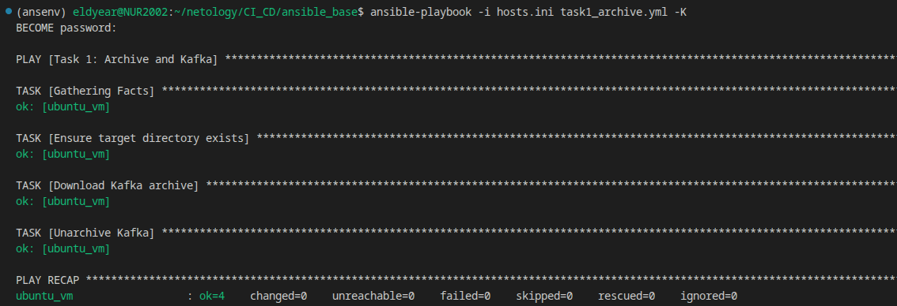
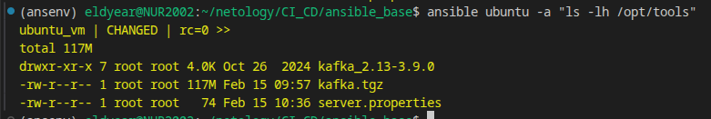

---

## 2. Плейбук для оптимизации системы (Tuned)
**Файл:** [`task1_tuned.yml`](./task1_tuned.yml)

**Что делает:**
1. Ставит пакет `tuned` через `dnf` (только на Fedora).
2. Стартует демона и ставит его в автозагрузку.
3. Применяет профиль `throughput-performance` через модуль `command`.

**Зачем:** Чтобы сервер не «спал», а выдавал максимум ресурсов под нагрузку (актуально для той же Kafka).

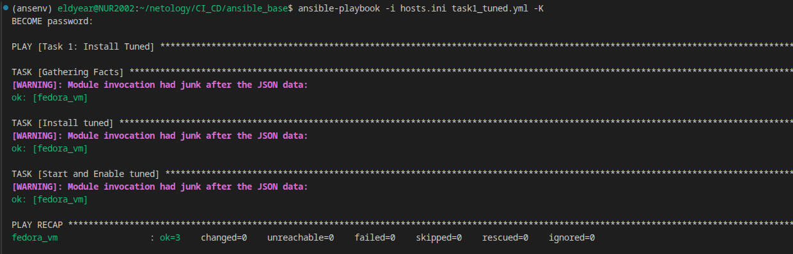
> **[WARNING]: Module invocation had junk after the JSON data:** В процессе выполнения плейбуков в консоли могут появляться предупреждения о «мусоре» (junk) после JSON-данных..
```bash
(ansenv) eldyear@NUR2002:~/netology/CI_CD/ansible_base$ ansible fedora -a "tuned-adm active"
fedora_vm | CHANGED | rc=0 >>
Current active profile: throughput-performance
```

---

## 3. Плейбук для кастомизации приветствия (MOTD)
**Файл:** [`task1_motd.yml`](./task1_motd.yml) и файл переменных [`vars.yml`](./vars.yml)

**Что делает:**
1. Берет текст приветствия из внешнего файла `vars.yml` (использовал `vars_files`).
2. Перезаписывает файл `/etc/motd` на всех серверах.

**Зачем:** Выполнил требование по использованию переменных. Теперь сразу видно, что сервер под управлением Ansible.

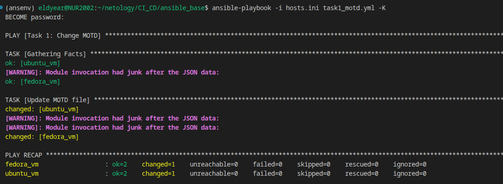
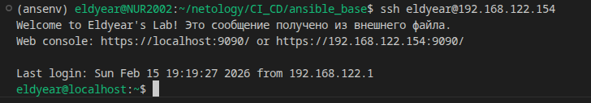

---

# Задания №2 (Ansible Facts & Templates)

### Что было сделано:
Модифицировал плейбук для настройки приветствия (MOTD). Теперь система динамически подставляет данные конкретного сервера, используя **Ansible Facts**.

---

## Реализация
Вместо модуля `copy` я использовал модуль `template`. Это позволило создать гибкий шаблон [`motd.j2`](./motd.j2), куда Ansible автоматически подставляет:
1. `ansible_facts['hostname']` — имя хоста.
2. `ansible_facts['default_ipv4']['address']` — IP-адрес.

**Зачем это нужно:** На больших фермах серверов это помогает админу сразу при входе понимать, на ту ли машину он попал.

**Файл:** [`task2_motd.yml`](./task2_motd.yml)

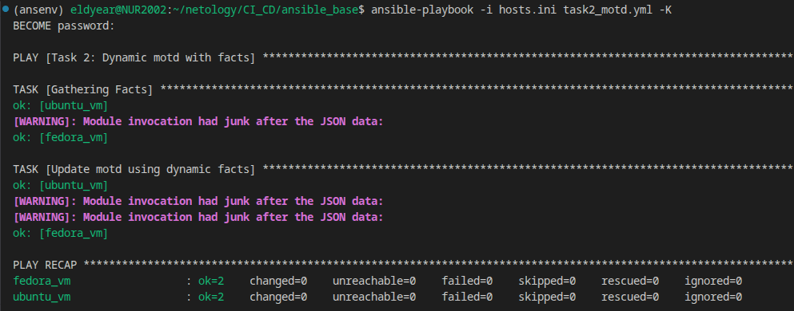

---

## Результат проверки
После запуска я зашел на обе виртуалки (Ubuntu и Fedora).

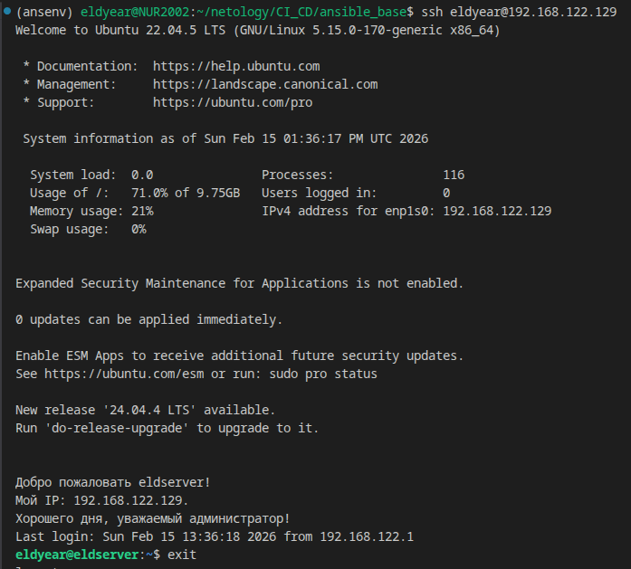 \
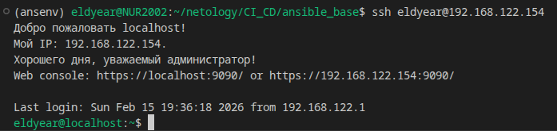

---

# Задания №3 (Роли, Хендлеры и Кроссплатформенность)

### Что было сделано:
Создал и применил роль `webserver` для автоматического развертывания веб-сервера Apache. Главная фишка — роль абсолютно универсальна и корректно работает как на Ubuntu, так и на Fedora, несмотря на разные названия пакетов и сервисов.

---

## Технические особенности реализации:
1. **Разделение логики:** Использовал [`vars/main.yml`](./roles/webserver/vars/main.yml) для определения переменных `apache_package` и `apache_service` в зависимости от семейства ОС (`Debian` vs `RedHat`).
2. **Шаблонизация Jinja2:** Создал динамический [`index.html.j2`](./roles/webserver/templates/index.html.j2). Он вытягивает реальные характеристики железа (CPU, RAM, HDD) через `ansible_facts`.
3. **Идемпотентный Handler:** Реализовал обработчик `Restart Apache`. Сервис перезагружается только в том случае, если изменился шаблон страницы. Это экономит ресурсы и время.
4. **Безопасность (Firewall):** Для Fedora добавил задачу через модуль `firewalld`, чтобы открыть 80-й порт, иначе сайт не был доступен снаружи.
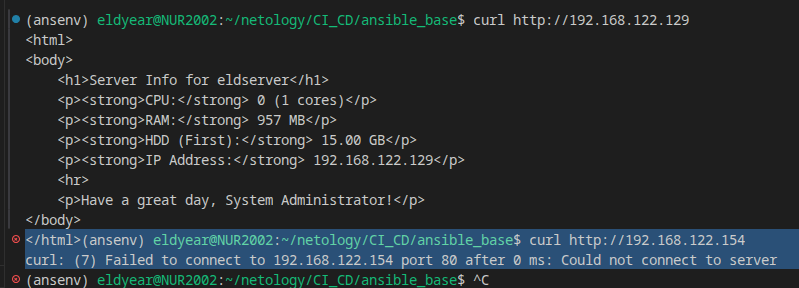
5. **Контроль качества:** В конце роли используется модуль `uri` для автоматической проверки, что сервер вернул код `200`.

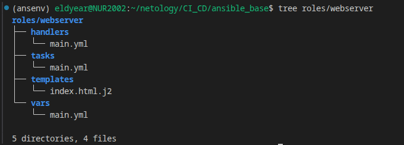 \
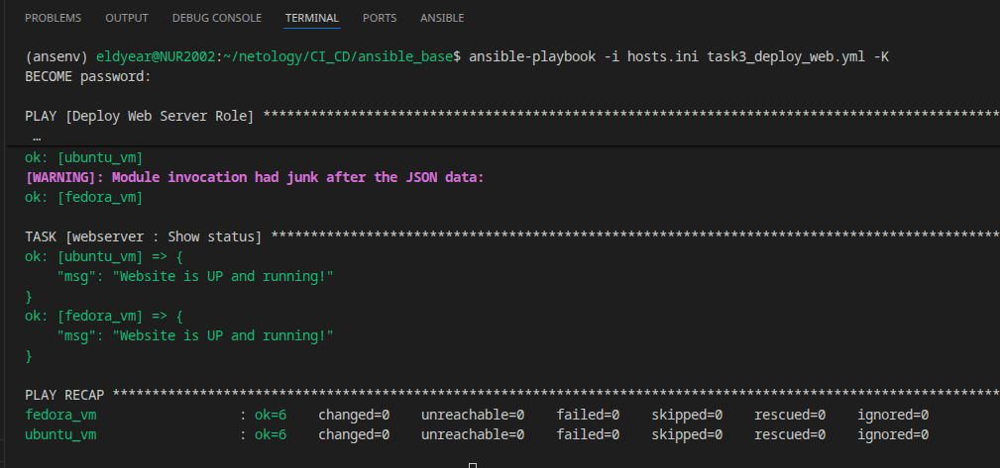

---

## Результат работы
После выполнения плейбука сервер отдает страницу с актуальными данными хоста.

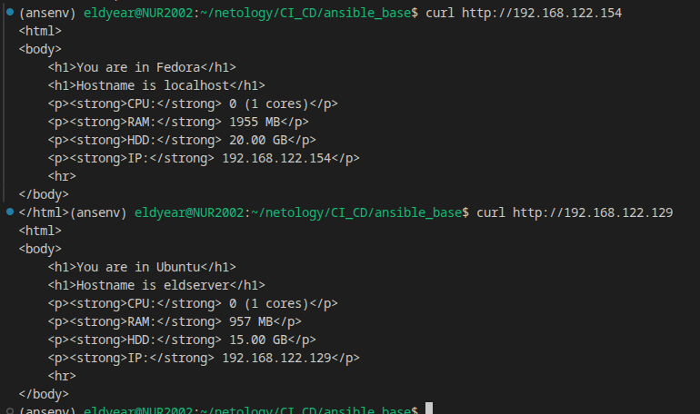 \


> **Стилизация моя слабость** Скриншот из браузера, где красиво отрендерен HTML с инфой о CPU и RAM.

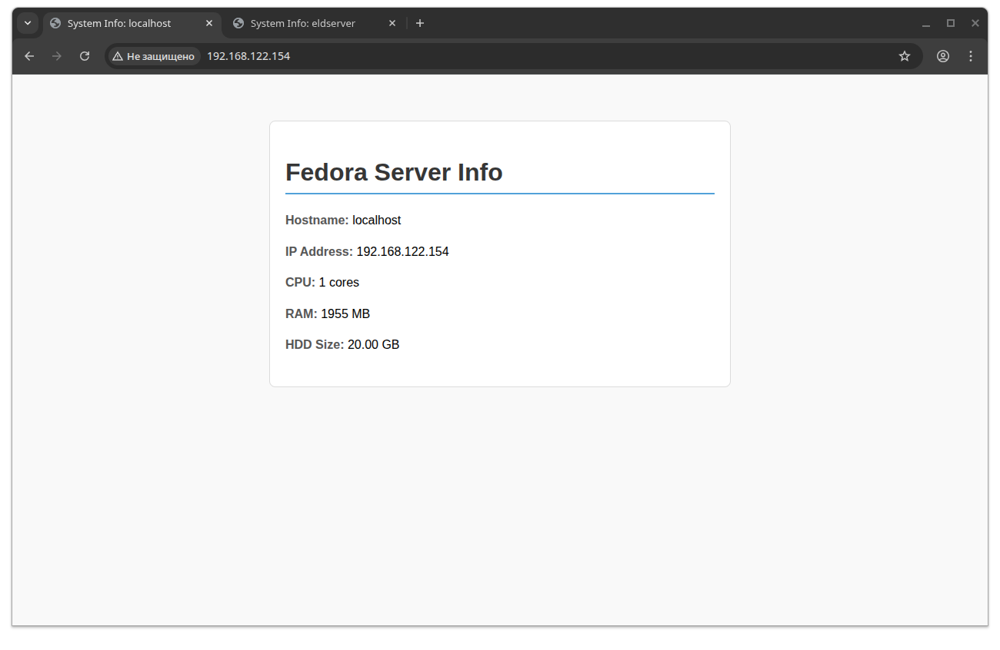

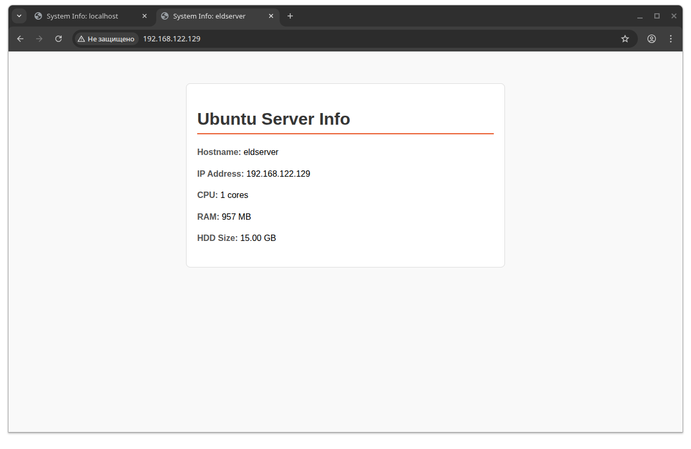


---

## Ссылки на материалы:
* **Роль в архиве:** [webserver_role.tar.gz](https://drive.google.com/file/d/10XJ9eelR0wm25G97SPboGmFjOVWeoF4_/view?usp=sharing)
* **Исходный код:** [GitHub](https://github.com/eldyear/ansible_hw_netology.git)


## Итог
Все задачи выполнены. Плейбуки идемпотентны (при повторном запуске ничего не ломают, статус `changed=0`). Ошибок нет, профит!